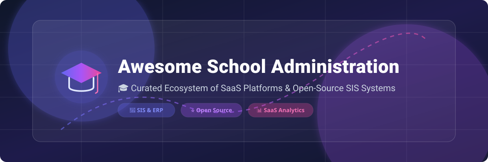

# 🎓 Awesome School Administration & Student Information Systems (SIS) 🏫

  
  
  
  
  

> 🚀 **Curated directory of top-tier SaaS platforms & active open-source GitHub projects for K-12, Higher Education, and Coaching Administration.**

A comprehensive, SEO-optimized guide tracking modern **Student Information Systems (SIS)**, **School ERPs**, **Learning Management System (LMS) companions**, **Tuition & Fee Software**, **Attendance Trackers**, and **Parent-Teacher Portals**.

---

## 📌 Table of Contents

- [☁️ SaaS / Hosted Platforms](#-saas--hosted-platforms)
- [💻 Open-Source GitHub Projects](#-open-source-github-projects)
- [💡 Key Capabilities & Modules](#-key-capabilities--modules)
- [🤝 How to Contribute](#-how-to-contribute)
- [🛡️ Compliance & Disclaimer](#-compliance--disclaimer)
- [📈 Star History](#-star-history)

---

## ☁️ SaaS / Hosted Platforms

> 📊 **Market Intelligence Note**: The global School Administration & Student Information System (SIS) software market is estimated at **~$13.5 Billion** (projected to exceed $25 Billion by 2030 at a ~12.5% CAGR). The sector is **moderately to highly fragmented** — while large North American public school districts exhibit concentration around legacy enterprise market leaders (e.g., PowerSchool, Blackbaud, FACTS), the international private school, academy, and coaching sectors remain widely fragmented across hundreds of specialized regional ERP platforms rather than a single winner-take-all monopoly.

| 🏫 Platform | 📝 Description | 🏢 Company Size / Valuation | 💰 Starting Pricing | 🎁 Free Tier / Free Trial Limits |
| :--- | :--- | :--- | :--- | :--- |
| **[PowerSchool](https://www.powerschool.com/)** | Leading enterprise K-12 SIS for enrollment, gradebooks, attendance, state compliance reporting, and district analytics. | ~$5.6 Billion Valuation (~$750M+ annual revenue) | ~$5 – $16 per student / year (min. ~$6,000/year base contract) | No free tier or free trial (Free live demo on request) |
| **[FACTS Management](https://factsmgt.com/)** | Private & faith-based K-12 platform unbundling SIS, tuition management, financial aid, and family portals. | ~$4.55 Billion Parent Market Cap (Nelnet, NYSE: NNI / ~$308M annual segment revenue) | ~$1,000 / year (base platform starting tier) | No free tier or free trial (Free live demo on request) |
| **[Blackbaud K-12](https://www.blackbaud.com/)** | Total cloud suite for private K-12 institutions covering academics, enrollment, tuition, advancement, and operations. | ~$2.1 Billion Market Cap (NASDAQ: BLKB / ~$1.1 Billion annual revenue) | ~$21,000 / year (starting tier for private school implementations) | No free tier or free trial (Free customized demo on request) |
| **[Teachmint](https://www.teachmint.com/)** | Mobile-first school ERP & coaching center platform with digital classroom tools and administrative management. | ~$500 Million Valuation (Series B backed by Lightspeed & Rocketship.vc) | ~$5 per user / year (or ~₹150,000/year base institutional tier) | Free Forever Plan (up to 100 students for individual tutors with basic classroom tools) |
| **[Gradelink](https://www.gradelink.com/)** | User-friendly cloud SIS popular with small-to-mid private and independent schools for grading, attendance, and reports. | ~$30M – $60M Est. Valuation (~$10M – $20M annual revenue) | ~$117 / month (starting plan for up to 50 students, plus setup fee) | Free Demo Account (preloaded with sample data, no set expiry days; no ongoing free tier) |
| **[Entab CampusCare](https://www.entab.in/)** | Enterprise Indian school management ERP covering academic records, examination, fee collection, and mobile apps. | ~$30M – $60M Est. Valuation (~$10M – $25M annual revenue) | ~₹200 – ₹500 ($2.50 – $6.00) per student / year | No free tier or free trial (Free personalized demo session on request) |
| **[Alma SIS](https://www.getalma.com/)** | Modern cloud SIS for K-12 schools and districts emphasizing progressive analytics, intuitive workflows, and state reporting. | ~$25M – $50M Est. Valuation (~$5M – $15M annual revenue) | ~$5,000 / year (starting tier for small school implementations) | No free tier or free trial (Free 1-on-1 demo on request) |
| **[Classter](https://www.classter.com/)** | All-in-one SIS, LMS, and CRM platform suitable for K-12, higher ed, and academies with multi-campus automation. | ~$20M – $50M Est. Valuation (~$5M – $10M ARR) | ~$5 – €8.50 per student / year (Core module starting tier) | No free tier or free trial (Free live demo on request) |
| **[MyClassCampus](https://www.myclasscampus.com/)** | Regional school ERP platform offering campus management, fee processing, attendance, and parent-teacher mobile apps. | ~$10M – $20M Est. Valuation (~$2M – $5M annual revenue) | ~₹100 – ₹200 ($1.50 – $2.50) per student / year | 14-day Free Trial (full access to basic administrative features during trial) |

---

## 💻 Open-Source GitHub Projects

> 🌟 **Self-Hosted & Community-Driven Systems**: Mature open-source alternatives providing complete privacy, source code ownership, and customizable database schemas for institutions worldwide.

- **[Moodle](https://github.com/moodle/moodle)**   
  World's most widely deployed open-source Learning Management System (LMS) and student portal ecosystem (PHP). Frequently paired with open-source SIS backends.

- **[School Management System (PHP/Laravel)](https://github.com/hrshadhin/school-management-system)**   
  Feature-rich open-source school management system built with Laravel covering multi-user roles, fee management, exam scheduling, and class attendance.

- **[OpenEduCat ERP](https://github.com/openeducat/openeducat_erp)**   
  Comprehensive open-source enterprise ERP (LGPL) built on Python/Odoo with 70+ modules covering SIS, LMS, accounting, HR, timetabling, and parent portals.

- **[MERN School Management System](https://github.com/Yogndrr/MERN-School-Management-System)**   
  Modern full-stack JavaScript school management platform built on React, Node.js, Express, and MongoDB for student & teacher dashboards.

- **[RosarioSIS](https://github.com/francoisjacquet/RosarioSIS)**   
  Open-source Web-based Student Information System (PHP/PostgreSQL) with modules for gradebooks, attendance, discipline, billing, and U.S. state reporting.

- **[Gibbon Core](https://github.com/GibbonEdu/core)**   
  Flexible, actively maintained open-source school management platform (PHP) designed for teachers, students, parents, and leaders with strong curriculum timetabling.

- **[Frappe Education](https://github.com/frappe/education)**   
  Open-source school and university management system built on the Frappe Framework and ERPNext covering student records, admissions, fees, and courses.

- **[Django School Management](https://github.com/TareqMonwer/Django-School-Management)**   
  Clean Python/Django open-source school management portal handling student enrollment, teacher grading, attendance, and administrative reports.

- **[Fedena Classic](https://github.com/projectfedena/fedena)**   
  Classic open-source school management system built on Ruby on Rails that pioneered free SIS platforms; community edition remains active alongside commercial tiers.

- **[openSIS Classic](https://github.com/OS4ED/openSIS-Classic)**   
  Long-standing commercial-grade open-source SIS foundation (PHP/MySQL) powering K-12 schools and higher-ed institutions with attendance, transcript, and grade management.

---

## 💡 Key Capabilities & Modules

Modern school administration platforms and SIS software solutions typically encompass:
- 🎒 **Student Records & Enrollment**: Centralized demographics, emergency contacts, transcripts, and admissions pipelines.
- 📝 **Gradebooks & Transcripts**: Standards-based grading, report cards, GPA calculations, and official transcript generation.
- 📅 **Attendance & Timetabling**: Automated daily/period attendance tracking and complex automated schedule generation.
- 💳 **Tuition & Fee Billing**: Invoice generation, payment gateway integration, payment plans, and financial aid tracking.
- 📱 **Parent & Student Portals**: Native iOS/Android mobile apps and web portals for real-time grade updates and communication.
- 📊 **State & Regulatory Reporting**: Compliance integrations for FERPA, GDPR, and state education department data feeds.

---

## 🤝 How to Contribute

Contributions are warmly welcome! To submit a new SaaS platform or open-source repository:

1. 🍴 **Fork** this repository.
2. ✏️ **Edit** `README.md` following the tabular or starred list standard.
3. 🔍 **Provide Factual Info**: Include product name, official website/repo link, verified starting pricing, company size/valuation, and accurate free tier limits.
4. 📥 **Submit a Pull Request** with a brief summary of additions.

---

## 🛡️ Compliance & Disclaimer

- **Privacy & Security**: School administration tools manage sensitive minor data. Deployments must adhere to applicable student privacy laws (**FERPA**, **COPPA**, **GDPR**) and enforce strict encryption, role-based access control, and audit logs.
- **Self-Hosting Responsibility**: Open-source systems provide full data autonomy but require routine security patching, database backups, and proper infrastructure management.

---

## 📈 Star History

---

**Made with ❤️ for school administrators, IT directors, registrars, teachers, and ed-tech developers.**
